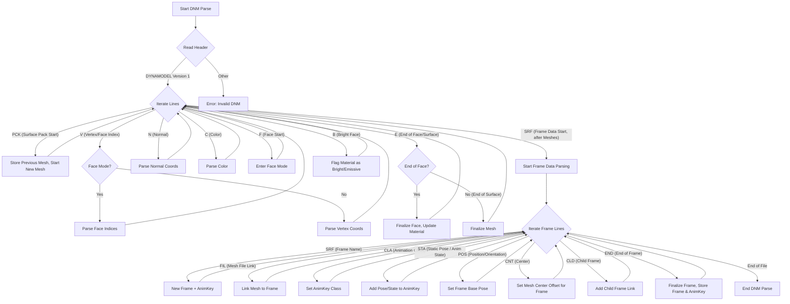
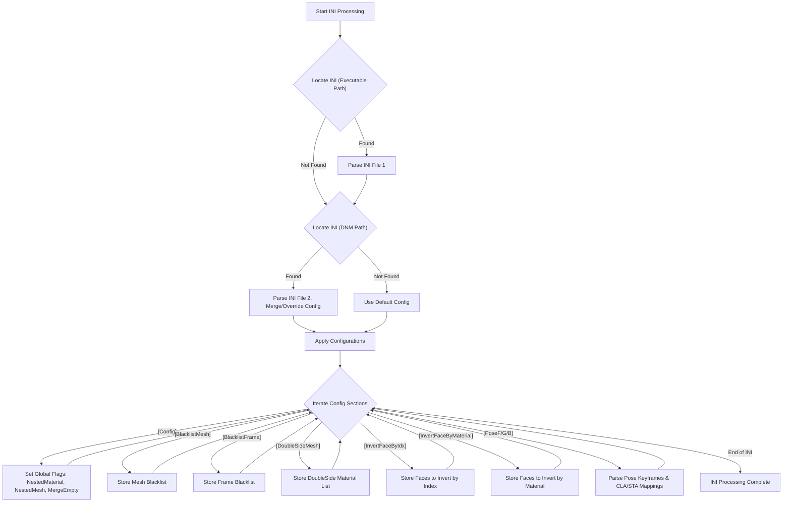
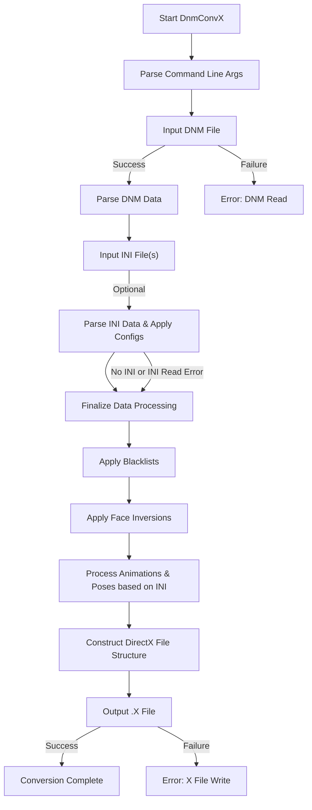

# DnmConvX

**DnmConvX** is a command-line utility designed to convert YSFlight Dynamodel (`.dnm`) files into the DirectX (`.x`) file format. This allows YSFlight models to be used in applications and game engines that support the DirectX mesh format.

The tool also supports an optional INI configuration file for more advanced control over the conversion process, including mesh and frame blacklisting, material handling, and animation pose adjustments.

## Features

*   Converts `.dnm` model geometry, materials, and basic structure.
*   Supports animation data translation from `.dnm`'s format to DirectX animation sets.
*   Allows fine-tuning of the conversion via an `.ini` configuration file.
*   Provides options for:
    *   Nested material and mesh definitions.
    *   Merging empty animation frames.
    *   Blacklisting specific meshes or frames from the output.
    *   Designating materials as double-sided.
    *   Inverting face normals by index or material.
    *   Custom animation pose configurations.

## Command-Line Usage

The basic syntax for using DnmConvX is:

```sh
DnmConvX.exe <input_dnm_file_path> [output_x_file_path]
```

*   `<input_dnm_file_path>`: **Required.** Specifies the path to the input `.dnm` file.
*   `[output_x_file_path]`: **Optional.** Specifies the desired path for the output `.x` file. If omitted, the `.x` file will be created in the same directory as the input `.dnm` file, with the same base name (e.g., `airplane.dnm` will produce `airplane.x`).

**Examples:**

1.  Convert `airplane.dnm` and save as `airplane.x` in the same directory:
    ```sh
    DnmConvX.exe airplane.dnm
    ```

2.  Convert `my_model.dnm` and save to a specific path `C:\output\my_model_converted.x`:
    ```sh
    DnmConvX.exe my_model.dnm C:\output\my_model_converted.x
    ```

3.  Display help information:
    ```sh
    DnmConvX.exe /H
    ```

## Configuration File (`.ini`)

DnmConvX automatically looks for and loads configuration settings from `.ini` files in two locations (in this order):

1.  **Next to the executable:** An `.ini` file with the same base name as the executable (e.g., `DnmConvX.ini`) located in the same directory as `DnmConvX.exe`.
2.  **Next to the input `.dnm` file:** An `.ini` file with the same base name as the input `.dnm` file (e.g., if converting `airplane.dnm`, it looks for `airplane.ini`) located in the same directory as the `.dnm` file.

Settings from both files are merged if both exist, with settings from the `.dnm`-specific `.ini` file potentially overriding those from the executable-specific `.ini`.

### INI File Format and Options

The `.ini` file uses standard INI formatting with sections and key-value pairs. Comments start with `#`.

**Supported Sections and Options:**

*   **`[Config]`**: General conversion settings.
    *   `UseNestedMaterial`: Set to `true` to enable nested material definitions in the output .x file. Default: `false`.
    *   `UseNestedMesh`: Set to `true` to enable nested mesh definitions in the output .x file. Default: `false`.
    *   `MergeEmptyFrames`: Set to `true` to merge animation frames that have no associated mesh and a single child frame, potentially simplifying the animation hierarchy. Default: `false`.

*   **`[BlacklistMesh]`**: Lists meshes to exclude from the conversion.
    *   Each line is a mesh name (e.g., `INTERNAL_DETAIL_MESH`).

*   **`[BlacklistFrame]`**: Lists animation frames (and their associated data/children) to exclude.
    *   Each line is a frame name (e.g., `LANDING_GEAR_DEBUG_FRAME`).

*   **`[DoubleSideMesh]`**: Lists materials that should be marked as double-sided in the output .x file.
    *   Each line is a material name. (Note: The actual application of double-sided rendering depends on the engine loading the .x file).

*   **`[InvertFaceByIdx]`**: Specifies meshes and face indices within those meshes where face normals should be inverted.
    *   Format: `MeshName FaceIndex` (e.g., `FUSELAGE 101`).

*   **`[InvertFaceByMaterial]`**: Specifies meshes and material names; faces using these materials within the specified meshes will have their normals inverted.
    *   Format: `MeshName MaterialName` (e.g., `WING_LEFT TransparentCanopyMaterial`).

*   **`[PoseF]`, `[PoseG]`, `[PoseB]`**: Used for custom animation pose configurations, typically for models with multiple transformation states (e.g., Fighter, Gerwalk, Battroid modes in variable fighter aircraft).
    *   The first line in each section, starting with `k`, defines a set of keyframe numbers (e.g., `k 0 10 20`).
    *   Subsequent lines define `CLA STA` pairs (Animation Class and State Index from the DNM) that map to these keyframes. For each `CLA STA` pair, the converter will generate animation keys at the previously defined keyframe numbers, using the pose data (position, orientation) from that specific `STA` for the given `CLA`.
    *   Example for `[PoseF]`:
        ```ini
        k 0 100 200 # Defines keyframes 0, 100, 200 for this pose
        1 0         # Animation Class 1, State 0 will be mapped to keyframes 0, 100, 200
        2 5         # Animation Class 2, State 5 will be mapped to keyframes 0, 100, 200
        ```

## Conversion Process Overview

The following diagrams illustrate the main data processing flows within DnmConvX.

### 1. DNM File Parsing (Conceptual)

This diagram shows the conceptual flow of how a `.dnm` file is parsed into its constituent parts like meshes, frames, and animation data. Due to the complexity of the original parsing logic, this is a high-level representation.



### 2. INI File Processing

This diagram outlines how DnmConvX processes `.ini` configuration files to customize the conversion.



### 3. Overall Conversion Flow

This diagram provides a high-level view of the entire conversion process, from command-line arguments to the final `.x` file output.


